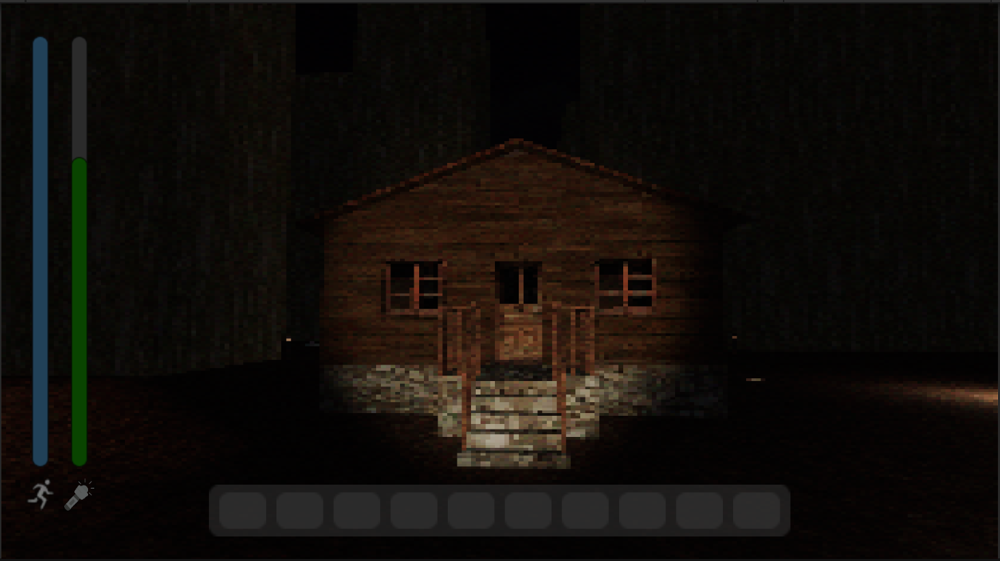
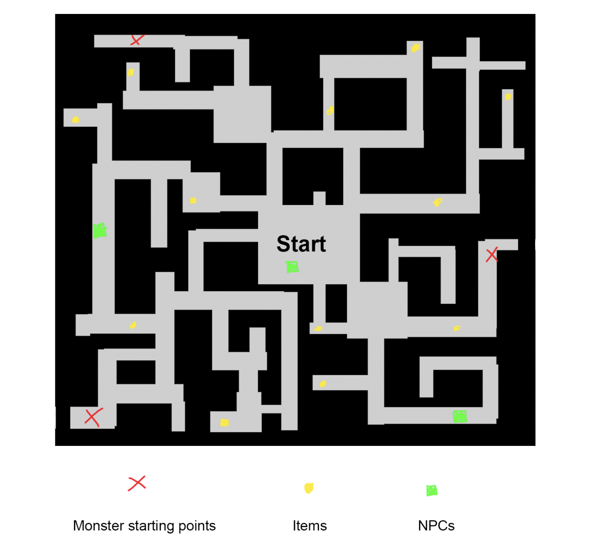
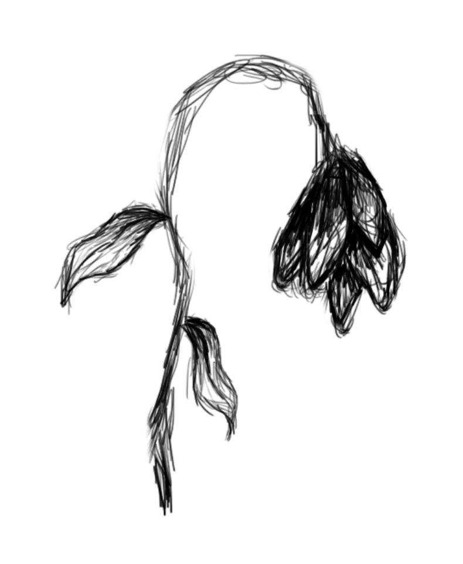
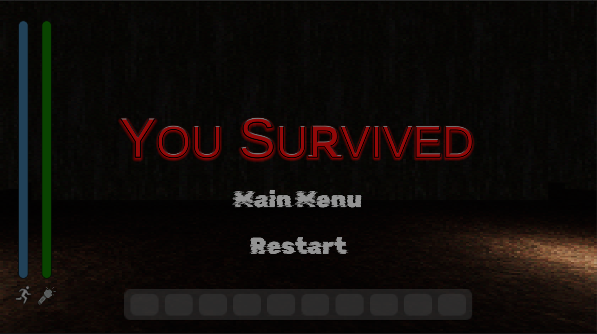
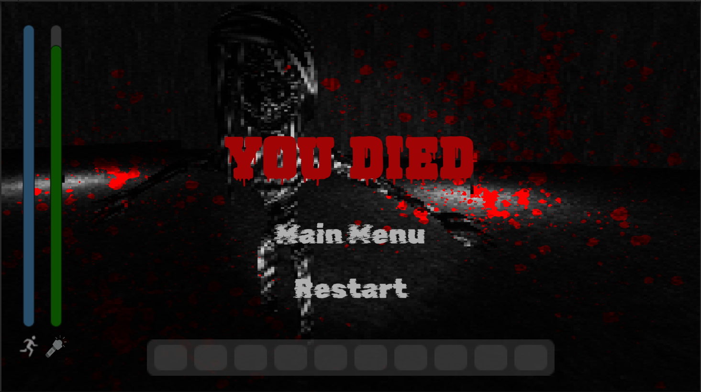

# Game Design Document - _Repentance_

## Table of Contents
- [Game Overview](#1-game-overview)
- [Story and Narrative](#2-story-and-narrative)
- [Game Mechanics](#3-game-mechanics)
- [Levels and World Design](#4-levels-and-world-design)
- [Art and Audio](#5-art-and-audio)
- [User Interface](#6-user-interface)
- [Technology and Tools](#7-technology-and-tools)
- [Team Communication, Timelines and Task Assignment](#8-team-communication-timelines-and-task-assignment)
- [Possible Challenges](#9-possible-challenges)

## 1. Game Overview

### 1.1 Concept
_Repentance_ is a single-player survival game. Trapped in a maze with vengeful monsters that were once victims of the player’s family, the player’s primary objective is to stay alive for 5 minutes. At the same time, the player’s role is to confront their family’s dark past and make decisions that could shape their own fate.

### 1.2 Genre
_Repentance_ is a survival horror game. The player is challenged to survive for 5 minutes while trapped in the maze by either hiding or running from the monsters. The game sets up suspense by making use of horror game elements such as spine-chilling graphics, dark environments, unexpected attacks and eerie sound effects.

    

[Horror Sound Effect](./Audio/horror-sound-effect.mp3)

Music Referenced: *Horror SFX 3 by Pixabay 2022*

[Monster Growl](./Audio/monster-growl.mp3)

Music Referenced: *Deep Monster Growl by Pixabay 2022*

[Creepy Background Music](./Audio/creepy-background-music.mp3)

Music Referenced: *A Piano With A Creepy Atmosphere For Scary Stories by 
UNIVERSFIELD 2023*

[Spooky Ambience](./Audio/spooky-ambience.mp3)

Music Referenced: *Scary Spooky Creepy Horror Ambient Dark Piano Cinematic by SoundGalleryByDmitryTaras 2022*

### 1.3 Target Audience
Set in a maze with horror elements, the game is targeted at players who are drawn to experiencing thrill in a controlled environment. Additionally, the 5-minute time constraint on the game makes it suitable for players who prefer or can only afford to play in short bursts.

### 1.4 Unique Selling Points

#### 1.4.1 Compelling Storyline
_Repentance_ follows a storyline that progressively unfolds as the player explores the maze. The player’s role is not only to survive, but also to uncover the gruesome truth about their family and face the consequences of their past actions. The intertwining of survival and story progression creates an immersive experience that keeps players emotionally engaged.

#### 1.4.2 Appealing Aesthetic
Inspired by the dystopian science fiction film ‘Maze Runner’, the game features a pixelated maze-like environment where the walls are overgrown with foliage. The pixelated graphics style creates a nostalgic retro feel while the foliage, just as it conceals the features of the maze, symbolizes the hidden secrets and dangers that lurk in the player’s world.

    

    <i>Image: Film (Maze Runner) by Wes Ball 2014</i>

    

#### 1.4.3 Unique Mechanics
_Repentance_ includes player stamina as a gameplay mechanic that reflects a realistic physical limitation of the player’s character and heightens the challenge of the game. Stamina allows the player to run away from the monsters and gradually replenishes when the player walks. Having to balance multiple resources adds depth to the gameplay and encourages the player to think strategically.  
The player also has a flashlight which has limited battery. The battery is intended to last approximately 3 minutes and makes the game significantly more challenging for the player. The player has the opportunity to interact and complete tasks set by NPCs to refill some of the flashlights battery.

    

## 2. Story and Narrative

### 2.1 Backstory

The story starts with the player receiving the will of their estranged parents, it details only one request. That the player retrieve the family heirloom located at the old family home located deep within the countryside.

- The main character had received a letter detailed in their parent's will, this was to be delivered to them upon their parent’s passing.
- The letter described a location containing a family heirloom. 
- The location was said to be the old location of the family home, found deep within the countryside
- The player tracks the location but they are confused by the request to retrieve the heirloom. 
- The location can be described as isolated, the house located amongst rolling hills and foilage.
- The house can be described as a country log cabin, abandoned and worn down.
- Nothing appears to indicate much danger upon arriving at the location.
- Your family has a dark history.  
- The main character's family committed crimes against another family (murder).
- The heirloom is an old knife.

    
    
    
    

### 2.2 Story and Game Progression

Standard story implementation into the game through use of cut scenes and dialogue poses challenges given the constraints of short gameplay time. Therefore, alternate implementation of story through gameplay elements, art and implicit meaning via objects will be utilised.

- The monsters in the game are the victims of the player's family.
- Graves and Tombs found as an asset in the game refer to the graves of the victim family. They can be found behind the main house at the start of the game or within the maze when the game starts.
- The NPCs found in the maze can refer to family members who were involved in the incident involving the victims.
  - NPC's that were directly involved will further anger the monsters.
  - NPC's that were indirectly involved will feel remorseful and will aide the player. 
- Items found in the maze can refer to how the victims were killed or assist in appeasing the victims.
  - Eyeballs in a jar would suggest that the victims eyes were gouged.
  - The heirloom is a hunting knife which would suggest a rural / community driven environment.
  - Using the broken doll for the child monster will delay them from chasing the player.
  - Using the wilted flower on the tombstones is a sign of remorse towards the victims.
- As the player encounters different objects and NPCs, they may be able to piece together what happened in the past.

### 2.3 Characters

- Main Character : Brave but clueless, they understand that the heirloom is of great importance, they also hold great curiosity towards the strange location as well as towards the heirloom.
- Monster : There are three monsters, these represent the victim family
  - Parent : Chases if the player is too close
  - Parent : Teleports randomly
  - Child : Chases if the player is too close 
- NPC : These can be encountered in the maze, they can either help the player or increase the difficulty of the game.

#### 2.3.1 NPC Drafting and Model

This particular NPC is mute, and has no eyes, but will return an item when given the Jar of Eyeballs. The NPCs are ghosts and are therefore transparent.

    
    

#### 2.3.2 Monster Drafting and Models

    
    

| Description | Model |
| --- | --- |
| Parent #1: This monster will chase the player when they get too close and randomly teleport throughout the maze. | 

 |
| Parent #2: This monster will immediately chase the player once it sees them | 

 |
| Child: This monster will immediately chase the player once it sees them. Their legs were brutally cut off. | 

 |

## 3. Game Mechanics

### 3.1 Player Perspective
First-person perspective where the player’s view is defined by the camera. The player is able to move the camera to create the impression that they are looking around the game. This perspective choice enhances the horror genre of the game as the player becomes the character and the limited field of view intensifies the uncertainty of the maze.

    
    

    <i>Gif: Counter-Strike 2 by Valve Corporation 2023 & Gif: Valorant by Riot Games 2020</i>

### 3.2 Controls

#### 3.2.1 Basic Controls
- W -> forward
- A -> left
- S -> backward
- D -> right
- Mouse -> camera

#### 3.2.2 Other 
- E -> interact with game objects
- shift + W/A/S/D -> sprint
- F -> flashlight
- Esc -> open game menu

### 3.3 Progression
The player begins in an introduction scene where they need to walk to the house to find a letter and the heirloom. After reading the letter the player becomes trapped within the maze and they must survive 5 minutes until in order to win.
The maze contains 3 monsters. Each monster has a different attack style and the player must avoid these monsters as one attack from any monster will kill the player. 
Behind the house in the maze, the player will find tombstones that belong to the mosnters. The player will have the opportunity to interact with the tombstone using different items found throughout the game. The player will also come across different NPCs throughout the maze. The player can interact with the NPCs. The 3 NPCs have different functions. The NPC found next to the house at the start of the maze is neutral. It can give the player hints as to how long the game has left. The second NPC wants the players help to find it's eyes that were stolen. If the player interacts with the NPC whilst they have the eyeballs in their inventory, they will recieve a reward. The third NPC is against the player. Interacting with this NPC will put the player at some disadvantage.

### 3.4 Gameplay Mechanics
The player is able to walk (using WASD) or sprint (using WASD + shift). The sprint capability is limited by a stamina bar that is depleted and slowly refilled. Additionally, the player is able to use the F key to equip a flashlight in areas of the maze that are too dark for the player to be able to see in. The player will come across different tombstones, items and NPCs throughout the maze that they can interact with using the E key.
The limitation of the sprint ability and the flashlight battery, along with the limited light within the maze will make the game more challenging for the player.
In order to make the game more engaging for multiple attempts, a different maze will be created in each run of the game.

## 4. Levels and World Design

### 4.1 Game World 

The world seen by the player is a maze with an aesthetic style inspired by the Maze Runner. It is 3D and will be displayed on a single screen. There is only one level, however, the maze will be randomly generated and changed each time the game is played. This allows the game to be replayed multiple times. The player will also be able to change the difficulty between easy and hard. The player starts in the centre of the maze and will have to navigate through the maze by exploring and avoiding monsters. Letters containing lore will be found inside the maze alongside other useful items. However, no map/minimap will be available as it would defeat the purpose of the maze. 

  

Tombstones and the house are located at the start of the maze. An NPC can also be found at the start of the maze.

### 4.2 Objects 

- Tombstones. Player can interact with the tombstones using a candle or withered flower. 
  

  
  

- Heirloom. Looks like an old knife. Starts in the player's inventory. Used for lore purposes.
  

  
  

- Flashlight. Starts in the player’s inventory. Player can turn it on or off.
  

  
  

- The player can collect other items throughout the maze to affect gameplay or the storyline:
  - Eyeballs in a Jar (NPC Item)
    

    
    

  - Broken Doll (Distracts the monster child or can be given to NPC)
    

    
    

  - Candle (Can be placed on the graves)
    

    
    

  - Withered Flower (Can be placed on the graves)
    

    
    

  - Torn Letter (Reveals lore)
    

    
    

  - Salt (Temporarily repels monsters from an area)
    

    
    

### 4.3 Physics 

- Player will collide with the walls of the maze.
- Player will accelerate up to a certain speed when they sprint. 
- Player will decelerate to normal speed when they stop sprinting or run out of stamina. 
- Player will collide with tombstones.
- Player will collide with items.
- Player will collide with NPCs.
- Enemies will collide with the walls of the maze
- Enemies will collide with the player

## 5. Art and Audio

### 5.1 Art Style  
- Retro style, PSX Graphics
- Use of pixelated art, Low Poly Models
- Dark, sinister, uncomforting, uncanny

    

    <i>Image: Game (In The Mountains) by DecestiaDev 2021</i>

 
Overall, the intention is to implement a lower quality graphics setting as a stylistic choice that can be comparable to PSX Graphics. The idea is that this may allow missing details to be filled in by the player’s mind. In addition, lowering the quality may indicate some level of detachment from reality. However, it also further exacerbates the uncaniness of the scene, it can be described as something that appears familiar yet also different. Furthermore, the art style allows for the natural depiction of hard edges compared to smoothness that may commonly be associated with higher graphic quality. This reliance on hard edges in graphics may subconciously alert the player, keeping them uncomfortable and on edge.

     

    <i>Image: Game (Siren Head) by Modus Interactive 2018 & Image: Game (Baldi's Basics) by Micah McGonigal 2018</i>

### 5.2 Audio 

- Exudes a sombre atmosphere
- Character Sounds : footsteps, flashlight, breathing, item interactions, monster sounds
- Music: quiet / simple ambience that builds up progressively, monster encounter is intense, dire, alarming

### 5.3 Sound Design 

In terms of sound design, sounds will likewise feel lower in quality and granular texture. This is to complement the visual aspect of the game thematically. The sounds will feel as if they’re passing through a radio. Sounds in the game such as footsteps, doors and breathing shouldn’t feel pleasant to the ear, but should feel deliberate and noticeable. The player's actions in the game will take up valuable time and the sounds in the game should reflect these actions.

### 5.4 Music 

The music is rather simplistic tonally, typically consisting of low tones. This may build into something more intense as the time progresses. Additionally, intense music may be included for when the monster has encountered the player or is engaged in pursuing the player.

Stylistic examples of intended game music: 

[Roaming](./Audio/atmosphere.wav) 

[Ambience](./Audio/sense_of_dread.wav)

Music Referenced:

*Resident Evil 7 Original Soundtrack composed by: 
Akiyuki  Morimoto, Satoshi Hori, Miwako Chinone, Brian D'Olivera, Cris Velasco. 2017*

### 5.5 Assets 

In terms of utilising pre-built assets, they will typically be sourced from the Unity Store. As a baseline, this may include 3D models but edited over with custom textures in order to better suit the theme of the game. 

- [Tombstones and Sky](https://assetstore.unity.com/packages/3d/environments/fantasy/free-cartoon-halloween-pack-mobile-vr-45896)
- [Candle](https://assetstore.unity.com/packages/3d/environments/historic/modular-medieval-lanterns-85527)
- [Doll](https://assetstore.unity.com/packages/3d/props/horror-assets-69717)
- [Texture](https://assetstore.unity.com/packages/2d/textures-materials/stone/mc-dirt-stone-wall-free-sample-178284)
- [Enemy Texture](https://stock.adobe.com/au/search?k=scribble+texture&asset_id=550895819)
- [Wall Texture](https://www.textures.com/download/ConcreteMossy0114/128583)
- [Dirt Texture](https://www.deviantart.com/fabooguy/art/Dirt-Ground-Texture-Tileable-2048x2048-441212191)
- [Withered Flower Texture](https://unsplash.com/photos/jY9rX-E7ztU)
- [Eyeball Texture](https://www.filterforge.com/filters/1174.html)

## 6. User Interface

### 6.1 Start Screens
The initial screen will allow the user to start the game, access an about page, options page and controls page. Within the settings menu, the player is able to alter screen brightness, game volume and the difficulty level. 

    
    
    

### 6.2 In-Game Screens
Whilst playing the game the player has a very limited UI. They are able to see their stamina display, represented by a blue bar, but that is all. This means majority of the players attention will be focused towards playing rather than trying to understand different displays. The player can access the in-game settings menu by pressing escape. The player can also see an inventory bar which will allow them to interact with different game elements.

    
    

### 6.3 End Game Screens

    
    

## 7. Technology and Tools

- GitHub (Version Control)
- Unity (Game Engine)
- Figma (UI Design) 
- Reaper (DAW)
- Aseprite (Pixel Art Software)
- FMod (Audio Middleware)
- Adobe Photoshop (Photo Editing Software)
- Blender (3D Modeling Software)

## 8. Team Communication, Timelines and Task Assignment

### 8.1 Communication Platforms
- Messenger and Zoom (Discussions)
- Trello (Task Management)
- Google Docs (Documentation and Planning)

### 8.2 Project Breakdown
The development tasks have been broken into four main areas with each assigned to a team member:
- World design, audio and maze generation
- Character and camera
- Menus, UI, cutscenes and storyline progression
- Enemies and character interactions

### 8.3 Timeline
The tasks have been ordered by completion priority. The main game will be developed by the beginning of week 11, giving 3 weeks to implement user testing and further improvements to the game.

3/09 - Prototype
- Player and camera movement 
- Basic maze
- Monster #1 + 3D model
- Monster #2
- Monster #3
- Main menu
- User interface
- Tombstone
- Start location
- Interactable items (weapons, heirloom etc.) + display of inventory
- basic NPC interaction

17/09 - Week 9
- Maze generation
- Graphics Asset Creation + Implementation
- 3D model of monster #2 and #3
- 3D model of NPCs
- detailed NPC interactions

1/10 - Week 11
- Difficulty selection
- Cut-scene for game won
- Cut-scene for game lost

## 9. Possible Challenges

### 9.1 Time Constraint
Problem: Creating a detailed story that can be easily understood by the player within the 5-minute time frame.

Solution:
- Avoid including excessive backstory.
- Divide the story into segments and reveal the storyline naturally through character interactions.

### 9.2 Maze Generation
Problem: Creating a maze that can be mostly explored within the time limit but is also not too simple.

Solution:
- Playtest the maze with a variety of players to gauge their experience and adjust the maze’s complexity based on the feedback received.
- Design the maze with multiple pathways and dead ends to encourage player exploration without making it overly complicated.

### 9.3 Graphics & Audio
Problem: Implementation of horror elements that can effectively set up tension in the game and instill fear in the player.

Solution: 
- Make use of lighting techniques to create shadows and darkness in order to limit player visibility and create a sense of uncertainty.
- Incorporate eerie sound effects such as whispers and echoing footsteps to keep players feeling unsettled.

### 9.4 Narrative
Problem: Integration of story elements into the gameplay.

Solution: 
- Make use of cutscenes to convey key points of the storyline.
- Implement dialogue systems that enable players to converse with NPCs and choices made during these conversations can influence the outcome of the story.

### 9.5 Gameplay
Problem: Balancing difficulty in order to ensure players of all skill levels can enjoy the game.

Solution:
- Have different difficulty levels available.
- The game starts at an easy difficulty setting and progressively becomes harder. This eases the player into the gameplay.

