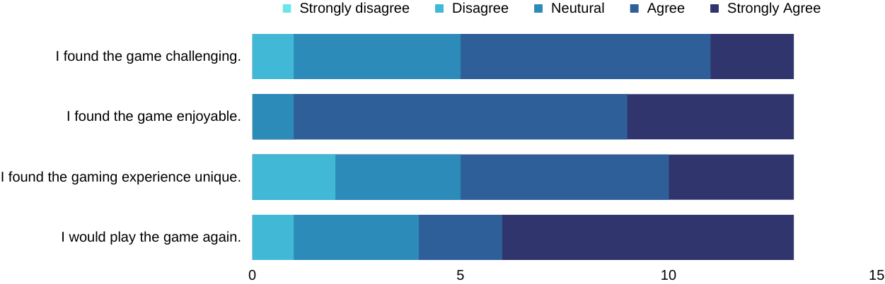
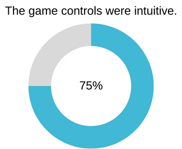
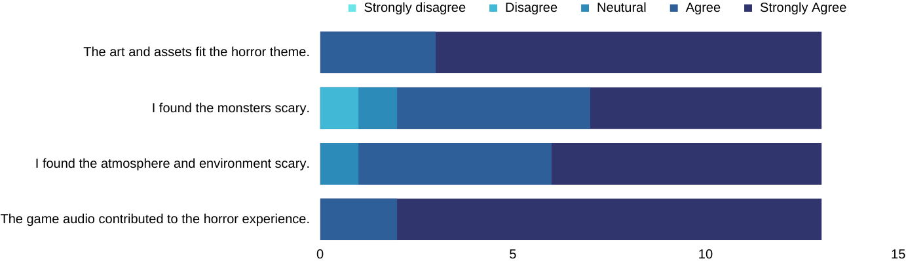
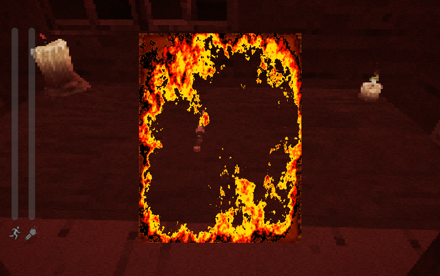
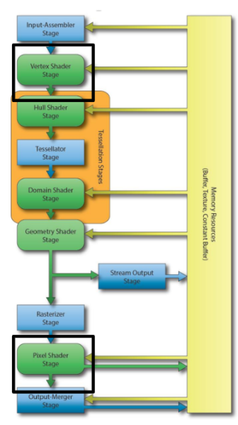
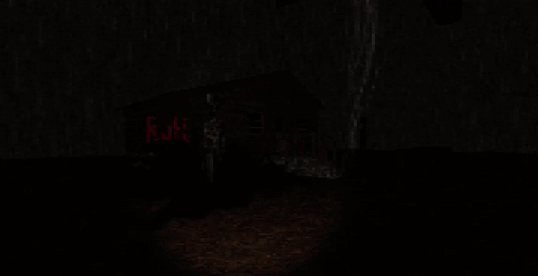

# Project 2 Report

## Table of Contents

- [Project 2 Report](#project-2-report)
  - [Table of Contents](#table-of-contents)
  - [Evaluation Plan](#evaluation-plan)
    - [Evaluation techniques](#evaluation-techniques)
    - [Participants](#participants)
    - [Data collection](#data-collection)
    - [Data analysis](#data-analysis)
    - [Timeline](#timeline)
    - [Responsibilities](#responsibilities)
  - [Evaluation Report](#evaluation-report)
  - [Shaders and Special Effects](#shaders-and-special-effects)
  - [Summary of Contributions](#summary-of-contributions)
  - [References and External Resources](#references-and-external-resources)

## Evaluation Plan

### Evaluation techniques
#### Querying Techniques
  - Interviews 
  - Questionnaires

In order to get the most impactful data through querying techniques we will use both questionnaires and interviews. After the participant has completed the assigned tasks in the game, they will be sent a google forms questionnaire that will ask them to rate different statements on a scale of 1-5. This will allow us to collect quantitative data that can be analysed in a deterministic way. After completing the questionnaire, the participant will be interviewed. Through an interview we will be able to collect more detailed qualitative data that can be analysed to provide deeper insights into that participants experience. The questionnaire and interview questions are discussed in more detail in [Data Collection](#data-collection), whilst the analysis methods are discussed further in [Data Analysis](#data-analysis).

#### Observational Techniques
  - Think aloud
  - Post-task walkthrough
  
  In order to get the most impactful data through observational techniques we will use a combination of think aloud and post-task walkthrough. Since the game is a horror game, the ambience created throughout the game must be maintained. Therefore, whilst think aloud will be used to allow the participant to clarify anything they need help with, hence allowing us to identify usability issues, any other discussion throughout game play will be kept to a minimum. Post-task walkthrough will be carried out by asking the participant about their thought process for a task immediately after the task is completed. The team member will take notes on different things that occured throughout game play and will discuss these with the participant after. The use of post-task walkthrough will allow us to gauge the memorability of our game and evaluate if these points are positive or negative. The post-task walkthrough notes are discussed further in [Data Collection](#data-collection), whilst the analysis methods are discussed further in [Data Analysis](#data-analysis).
   
#### Tasks to Perform
  1. Find and collect the heirloom
  2. Collect items for the graves
  3. Complete a task from an NPC
  4. Find and use at least 3 different items
  5. Find all NPCs

### Participants 

#### Target audience 
Set in a maze with horror elements, the game is targeted at players who are drawn to experiencing thrill in a controlled environment. Additionally, the 5-minute time constraint on the game makes it suitable for players who prefer or can only afford to play in short bursts.

#### Participants
Since it is difficult to find participants who specifically match our target audience, the requirement for participants is broadened to be people who enjoy computer games. In addition, participants who are not well-versed in horror games may provide unique viewpoints and the horror elements they experience may be more effective.

#### Recruitment 
Recruiting of participants will be primarily done through friends.

### Data collection

#### Types of Data Collected
  - Qualitative (from observational techniques and interview)
  - Quantitative from questionnaires

#### Collection Methods and Tools
  - Tools such as Zoom / Discord will be used with screen sharing and webcam for observational techniques
  - OBS Studio or Other screen recording software may be used to record participant gameplay 
  - Google forms for the questionnaire (https://forms.gle/xW9pgmztwRhmoVDX6)
  - Note down the results on a Google Document for the interview and observations

#### Interview Questions
  - Gameplay
      - What did you like most about the gameplay mechanics and dynamics in the game? 
      - What did you not like most about the gameplay mechanics and dynamics in the game?
      - Were there any aspects of the gameplay that you found confusing or frustrating? If so, please describe.
  - Story / Narrative
      - How would you summarize the storyline of the game?
  - Usability of interface
      - Were you at any point in the game confused or lost about what to do?
  - Game Experience
      - How did you feel about the NPCs in this game?
      - How would you describe the monsters in this game?
      - Was there anything in the game that felt out of place? If there was, please describe.
      - What would you consider to be the strongest aspect of this game? (Art, Music, Atmosphere, Story, Gameplay)
      - What would you consider to be the weakest aspect of this game?
      - If there was one thing you could add to this game, what would it be?

##### Interview Results Table
  [**Interviewee Name**]
  | Question | Answer |
  | ---- | ----|
  | … | … |

#### Questionnaire Questions 
The participant will rank each question on a scale of 1-5

| Question | Scale |
|----|----|
|I found the game challenging | Strongly disagree - strongly agree|
|I found the game enjoyable | Strongly disagree - strongly agree|
|I found the maze to be of a reasonable size and complexity | Strongly disagree - strongly agree|
|I found finding items... | Very difficult - very easy |
|I found the items.. | Not useful - very useful |
|I understood the storyline | Not at all - completely |
|I found the storyline engaging | not at all - very |
|I found the game controls... | Confusing - intuitive |
|I felt that the art and assets used were fitting to the theme of the game | Strongly disagree - strongly agree |
|I found the monsters scary | Not at all - extremely |
|I found the atmosphere and environment scary | Not at all - extremely |
|The game audio contributed to the horror experience | Not at all - a lot |
|I felt that 'Repentance' was a unique gaming experience | Strongly disagree - strongly agree |
|I would play the game again | Never - definitely |

#### Note Taking for Post-task Walkthrough

- the team member must take notes on events throughout gameplay that can be considered significant
- a significant event will be anything that lead the participant to either be confused or stuck, or an interesting method used to complete a task
- the team member should also note down events that lead the participant to ask questions or anything that lead to an unusual reaction from the participant
- responses to the questions asked by the team member should be recorded onto a google docs page

### Data analysis
#### Analysing the qualitative data
- Data will be categorised so that common themes can be seen
- Within each theme look for commonalities to link them
- Determine how the different themes relate to each other
- identify common terms and phrases across different responses
- Based on the common ideas found construct a priority list of changes that can be made to address the issues identified 
#### Analysing the quantitative data
- Look for trends in responses 
- Construct graphs to aid visualization of the result
- Based on the averages of results for each question, construct priority list of changes that can be made to address the issues identified

### Timeline

### Responsibilities
- Each team member will manage their own participants
- Each team member will have at least 4 participants (2 for querying and 2 for observabilities)
- The team will work together to complete the data analysis and construct the priority list for changes to be made
- The team will allocate tasks for the changes to be made to each member based on their current workload and available time
  

## Evaluation Report

### Participant Demographic
We conducted user evaluation on participants with varying levels of gaming experience. This was helpful for identifying potential design flaws in terms of the usability and accessibility of our game. Additionally, some of our participants are not well-versed in horror games. Our broad pool of participants provided us with a wider range of perspectives, which was valuable in ensuring that our game appeals to a more general audience.

### Methodology
For qualitative data collected, we utilized Canva to record the participant’s responses and gameplay behaviors. From the feedback received, we identified common pain points and critical issues experienced by our participants.

For quantitative data collected, we identified trends in responses through the use of graphical representations, including stacked row charts, pictograms and ring charts. This allowed us to visualize the results and identify questions that received negatively skewed responses. 

Based on commonalities between the qualitative and quantitative data and how frequently a problem was highlighted, we identified the issues we wanted to tackle and constructed a list of changes that can be made to address them. Lastly, we categorized and sorted the list of changes according to priority in order to ensure that we were able to address the most critical and impactful issues within the given limited time frame.  

### Analysis of Evaluation Results
#### Gameplay
Overall, most participants found the game challenging and enjoyable, agreeing that Repentance is a highly replayable game that offers a unique gaming experience. 

However, there were a few areas of improvement that could be made to enhance the quality of gameplay. Firstly, we observed multiple instances of the player dying too quickly or too suddenly. To prevent quick deaths, we chose to incorporate a timer to prevent monsters from killing the player too quickly at the beginning of the game. Moreover, we also decided to layer sound effects by having an additional soundtrack of a faster paced heartbeat, along with a visual effect of the screen flickering to black and white with a red blood splatter, when a monster is near. The purpose of this is to indicate to the player that he is in danger and give him a chance to run away. At the same time, this helps to add more suspense to the game.  

Secondly, our game also features interactable items that players can use to improve their chances of survival, adding an element of strategy to the game. However, the feedback we received was that it was difficult to find and understand the purpose of the items. Participants commented that “item description is a little unintuitive” and “how to use the items in the maze was a little confusing”.

As items are randomly placed in the maze to ensure that each game experience is varied, we decided to resolve the aforementioned issues by increasing the number of items generated. This is to heighten the chances of the player coming across items while exploring the maze. To help with understanding how to use the items, it was suggested to us that the explanation should be shown when the player collects the item instead of when trying to use it from the inventory. As such, we decided to refine player-item interactions by indicating the purpose of the item and which key to press to use it when the player collects an item.  

Another piece of feedback we received was regarding low visibility even when the flashlight was turned on. Participants found it overly hard to see and therefore navigate the maze, which negatively impacted their game experience. They mentioned that the “flashlight can be too dim”, which “made it very hard to see where I was going”. In response to this, we decided to increase the distance of the light from the flashlight to provide enough light for players to navigate. The player's field of view still remains relatively limited in order to make it challenging to anticipate what is ahead as this adds to the suspense of the game.  

Lastly, it was also commonly pointed out that it was hard to navigate the maze and survive once the flashlight ran out of battery as the player would be thrown into nearly pitch black darkness. A significant number of players also found it hard to navigate back to the house in the center of the maze after leaving it. Some suggestions were to add some light sources throughout the maze and “lit up the area of the house so that you can see the graves, and use it as an anchor point”. Taking those ideas into consideration while making sure to maintain a mysterious and spooky atmosphere, we decided to add fire torches on some walls of the maze and around the house. Furthermore, we chose to make the use of candles more versatile and functional by allowing them to be placed anywhere in the maze instead of being restricted to only be placed in front of the graves in our game. The basis for this is to provide alternative light sources for the player and to allow them to be potentially used as markers for route tracing back to the house. Since participants “assumed the candle would give you light”, gameplay will become more intuitive with this change. This may also encourage players to think more critically about how they can utilize their inventory to enhance their odds of staying alive, leading to more varied and strategic gameplay experiences.  

#### Storyline

In terms of storyline, it was highlighted to us that the transition from the introduction scene into the maze was jarring and lacked explanation. Participants said that it was “confusing going directly to the maze”. For a more seamless and explanatory narrative flow, we decided to add a cutscene in-between to provide players with a more engaging and meaningful context for the maze's appearance.

#### Game Controls
In general, a majority of the players found the game controls, especially the WASD movement controls, fairly intuitive.

However, there were a few areas we could improve on. First and foremost, a common pain point was that the mouse sensitivity was too high. However, there were also a select few who felt that it was set at an appropriate level. To accommodate different preferences, we chose to incorporate adjustable mouse sensitivity settings in the game's options menu. This will allow players to tailor their gaming experience to their comfort, enhancing gameplay and overall user satisfaction.  

While carrying out the observational techniques for evaluation, we also noticed that a considerable number of players either did not read or simply skipped the instructions for the game controls, which were displayed on the screen when the player first entered the maze. The reasons given were that the instructions were too lengthy and some also found it hard to absorb information when the game had already begun. Therefore, we came to an agreement that it would be better to give the instructions in the introduction scene before the player dives into the gameplay, and also in a more concise manner to make the experience more user-friendly.  

Moreover, an issue frequently raised by players was the use of the heirloom and flashlight in the inventory. The heirloom was included as an item in the inventory simply for lore and it served no purpose in terms of gameplay. However, it has been brought to our attention that participants found the heirloom knife “deceptive since you can't use it”. During gameplay, numerous participants tried to kill the monster with it or asked if they could “fight the monsters with the knife”. Additionally, as the flashlight can only be toggled on and off by pressing ‘F’ and not by interacting with the inventory like other items, it caused some confusion about the game controls. To resolve this disparity, we decided that it would be best to remove the heirloom and flashlight as items in the inventory. 

#### Game Experience
From the questionnaire results, we can see that the game art and music helped to deliver a chilling and immersive experience for our players. Participants who were interviewed also gave similar responses, making comments such as “the music and art really help create an anxiety inducing feeling”, “atmosphere, soundtrack and the crows made it feel creepy” and that the monsters were “very unnerving”.  

  

In particular, the game’s audio and unique art style were highlighted, with participants commenting that the game has “a very nice indie-game atmosphere and design” and “the pixelation and antique vibe was nice”. The pixelated graphics contributed to the indie horror vibe of the game, creating an unsettling and eerie atmosphere. The terrifying ambiance is further heightened through the use of a dark environment combined with a flickering flashlight, creepy sound effects (eg. pounding heartbeat, demonic whispers), as well as unnatural movements and distorted features of the monsters.  

However, one prominent issue was that the appearance of the NPCs was too similar to the monsters that players misunderstood them as being harmful, causing them to avoid interaction with the NPCs. Participants “keep hesitating to approach them because they actually look quite creepy” or wondered “why do the NPCs look like the monsters”. As the NPCs are used to deliver elements of the storyline and can impact the outcome of the game, we decided to change the particle system for the NPCs to make them look more harmless and encourage player interaction.
Additionally, the objective of the game was also unclear to some participants. They were “quite confused about what to do”. To highlight the time-survival aspect of the game, we decided to periodically display the amount of time left on the screen instead of using an NPC that hints about the amount of time left when the player interacts with it.
 
### Prioritization of Game Changes
#### Severity
To prioritize game changes effectively, we assessed the severity of each issue and suggestion. The severity was assessed based on several factors, namely the impact on the player experience, the number of players affected and whether it resulted in game-breaking problems. Game-breaking problems were given the highest priority, and issues that had a huge impact on player experience or affected a substantial number of players were also assigned a higher priority level. 
#### Implementation
Other than assessing the severity of the issue, we also considered the feasibility and how much effort it would take to implement the changes. Given the limited time frame, changes that required more extensive development were placed higher on the priority list while quick fixes were given a lower priority.
#### Final Priority List
Sorted from highest priority to lowest,  
1. Change the particle system for the NPCs to appear more harmless
2. Have a timer on the screen instead of indicating the time left through an NPC
3. Have indication of a monster nearby through the use of a faster paced heartbeat audio and visual effect 
4. Explain the purpose of each item when the player collects it instead of when it is being used
5. Add a cutscene in between the introduction and maze scene to explain the maze’s appearance
6. Add fire torches around the maze and the house to serve as light sources
7. Allow candles to be placed anywhere in the maze to serve as light sources and path markers
8. Increase the distance of light from the flashlight
9. Add mouse sensitivity controls in the options menu
10. Add a timer to prevent monsters from killing the player immediately at the start of the game
11. Deliver game instructions in the introduction scene before gameplay begins
12. Remove the heirloom and flashlight as items from the inventory

## Shaders and Special Effects

### Shaders
The following shaders can be found through these folders: Assets/shaders.  
Links are also provided below.

#### Burning Dissolve Shader
This shader acts as the visual tie between the introduction scene and the maze. The shader is applied to the letter that the player reads at the beginning of the game and to the NPCs within the maze. The shader acts to burn away the game object once its objective in the game is fulfilled. The letter is burnt when the user closes it and NPCs are burnt and disabled once the user completes their task.  

This shader is implemented across three different shader files. Firstly, Dissolve.cginc forms the base of the shader. It includes the vertex and fragment shader that implements the visual effect of dissolving and burning the texture. Secondly, the NPC.shader file is applied specifically to the NPCs and completes two passes, allowing the multiple light sources within the scene to be implemented correctly. Finally, the Letter.shader file is created as a UI shader and includes no culling or depth. This was to ensure it was not impacted by the full screen camera pixelation shader.

##### Relevant Materials and Scripts
- [NPCBody](Assets/Art/Models/NPC/Materials/NPCBody.mat)
- [Face](Assets/Art/Models/NPC/Materials/Face.mat)
- [Letter](Assets/Art/UIElements/Background/Letter.mat)
- [Wood](Assets/Art/Models/NPC/Materials/Wood.mat)
- [NoteInteract.cs](Assets/Scripts/InteractScripts/NoteInteract.cs)
- [NPCInteract.cs](Assets/Scripts/InteractScripts/NPCInteract.cs)
- [NPCInteractInventory.cs](Assets/Scripts/InteractScripts/NPCInteractInventory.cs)

##### Properties
###### _MainTex 
MainTex is the texture of the object. This property is set in the material of the object. Specifically, NPCBody, Face, Body, Material and Letter.
###### _DissolveTexture
DissolveTexture is a black and white texture that defines the areas of the object to dissolve fastest. This property is set in the material of the object. Specifically, NPCBody, NPCFace, Face, Body, Wood, Material and Letter. Each material has a different dissolve texture that was selected based on how the individual object should dissolve. For example, the letters material has a dissolve texture that represents two holes being burnt into the paper.
###### _Amount 
Amount controls how much of the texture has been dissolved. This property is set programmatically in the following C# scripts: NoteInteract.cs, NPCInteract.cs and NPCInteractInventory.cs.  

The Amount dissolved is incremented in the update function call to give the effect that the material is dissolving over time. The increment value was selected based on how long it should take for the object to dissolve (0.005 for the letter and 0.004 for NPCs). The letter dissolves quicker than the NPCs since the player is forced to wait for the letter to completely dissolve before the maze begins.
###### _Color 
Color is the colour the texture is tinted by. This colour is set in the material and is used to slightly change the hue of the texture. Specifically, NPCBody, Face, Body, Wood, Material and Letter. However, for the wood material in the NPC, the color is used instead of a texture so it forms the base colour of the NPCs wooden leg.
###### _Ka 
Ka is the ambient reflection constant. This constant is set in the material of the object and determines the strength of ambient reflection for Phong Shading. Specifically, NPCBody, NPCFace, Face, Body, Wood, Material and Letter.
###### _Kd 
Kd is the diffuse reflection constant. This constant is set in the material of the object and determines the strength of diffuse reflection for Phong Shading. Specifically, NPCBody, Face, Body, Wood, Material and Letter.
###### _Ks 
Ks is the specular reflection constant. This constant is set in the material of the object and determines the strength of specular reflection for Phong Shading. Specifically, NPCBody, Face, Body, Wood, Material and Letter.
###### _fAtt 
fAtt is the shininess of the object. This constant is set in the material of the object and determines the shininess of the object for Phong Shading. Specifically, NPCBody, Face, Body, Wood, Material and Letter.
###### _specN 
specN in the specular power of the object. This constant is set in the material of the object and determines the specular power of the object for Phong Shading. Specifically, NPCBody, Face, Body, Wood, Material and Letter.
###### _BurnSize 
BurnSize controls how much of the texture has been burnt. The implementation and control of this variable mirrors that of _Amount. This is to ensure that the burnt coloring is applied around the area that has been dissolved. The value is modified in the following scripts: NoteInteract.cs, NPCInteract.cs and NPCInteractInventory.cs.
###### _BurnMap 
BurnMap is a black and white texture that defines the areas of the object to burn fastest. This property is set in the material of the object. Specifically, NPCBody, Face, Body, Wood, Material and Letter. The black and white map used in BurnMap is the same as the texture used in DissolveTexture. This ensures the burn areas and dissolve areas line up correctly. 

##### Rendering Pipeline
  

This shader implements two parts of the rendering pipeline. The vertex shader and the pixel shader.  

The vertex shader is used to calculate the world vertex, world normal and UV coordinates from _MainTex.   

The fragment shader is used to apply texture clipping and coloring individual pixels to reflect the stage of burning and dissolving.

#### Tree Wind Shader
This shader acts as visual flair and an additional aesthetic that can be used to elevate the atmosphere of the beginning scene of the game.  

The shader is mainly utilised on the foliage that can be found in the introduction scene with the house, the trees and bushes are made to sway in manner that resembles the effects of wind acting upon the foliage. This shader is implemented across one primary file namely Tree.shader. 
Accessible here [Assets/shaders/Tree.shader](Assets/shaders/Tree.shader)  

    

##### Relevant Materials and Scripts
- [tree28](Assets/Art/Models/Nature/Materials/tree28.mat) 
- [tree29](Assets/Art/Models/Nature/Materials/tree29.mat) 
- [tree30](Assets/Art/Models/Nature/Materials/tree30.mat) 
- [tree31](Assets/Art/Models/Nature/Materials/tree31.mat) 
- [tree34](Assets/Art/Models/Nature/Materials/tree34.mat) 
- [tree36](Assets/Art/Models/Nature/Materials/tree36.mat) 
- [bush05](Assets/Art/Models/Nature/Materials/bush05.mat) 
- [bush07](Assets/Art/Models/Nature/Materials/bush07.mat) 
- [WindController.cs](Assets/Scripts/PlayerScripts/WindControl.cs)

##### Properties
###### _MainTex 
Texture of the object. Set in the editor to the texture of the object. In this case, these would be the tree textures.
###### _Color 
Base color of the texture. Set in the editor and applies a light tint to the object
###### _Cutoff  
Alpha Transparency cutoff threshold, an alpha value for a pixel lower than this value will be culled.
###### _Wavespeed 
Speed of the swaying, Set in the editor with the material
###### _Waveamp 
Amplitude of the swaying, this affects how magnitude of the the foliage sway. Set in the editor with the material
###### _HeightFactor 
Higher height factor results in stronger wind based on taller height. This is to simulate the effect of the higher portions of trees will bend further based off of wind effects.
###### _HeightCutoff 
Limits what is affected by the wind based on height value. This value is used so that the trunk of the tree would not be affected by the swaying motion. 
###### _WindTex 
Black and white gradient sample texture used to simulate the swaying of an object under windy conditions. The texture is a uniform gradient which simulates a higher sway based on darker pixels, due to this property, the texture goes from darker to lighter to darker.
###### _WorldSize 
Define worldsize as xyz
###### _WindSpeed 
Strength of the wind which affects the properties for _HeightFactor, _Waveamp and_Wavespeed, Set in the editor with the material
###### _Ka 
Ka is the ambient reflection constant. This constant is set in the material of the object and determines the strength of ambient reflection for Phong Shading. 
###### _Kd 
Kd is the diffuse reflection constant. This constant is set in the material of the object and determines the strength of diffuse reflection for Phong Shading. Specifically, NPCBody, Face, Body, Wood, Material and Letter.
###### _Ks 
Ks is the specular reflection constant. This constant is set in the material of the object and determines the strength of specular reflection for Phong Shading. Specifically, NPCBody, Face, Body, Wood, Material and Letter.
###### _fAtt 
fAtt is the shininess of the object. This constant is set in the material of the object and determines the shininess of the object for Phong Shading. Specifically, NPCBody, Face, Body, Wood, Material and Letter.
###### _specN 
specN in the specular power of the object. This constant is set in the material of the object and determines the specular power of the object for Phong Shading. Specifically, NPCBody, Face, Body, Wood, Material and Letter.

##### Rendering Pipeline
  
This shader would primarily be categorised as a vertex shader, as for this shader our goal is to mostly adjust the position of the material rather than changing it’s visual appearance. The properties used included _WindTex, _WindSpeed, _WaveAmp, _WaveSpeed, _HeightCutoff and _HeightFactor to adjust vertex position based on a wave function.  

 In the fragment shader, standard texture mapping is applied given _MainTex with standard Phong Shading applied, additionally alpha clipping is used to render the trees with leaves and transparent segments with _Cutoff. 

#### Particle System
Access [here](Assets/Art/Particles/Haze.prefab)  

The current particle system haze is currently in use by a malevolent NPC in the game. Adding particle effects in this manner helps to build atmosphere, adds important visual stimuli and flare to the game whilst revealing subtle information to the player.   

In this case, the goal of this particle system was to inform the player of a malicious entity, namely the NPC that this is being implemented on. The implementation of trailing shapes and dark colours were utilised to convey feelings of discomfort whilst simulating shadow like entities. The particles themselves can represent leering tendrils or shadowy hands, but primarily serve as a visual aesthetic to the game.

    

##### Properties
In order to simulate and replicate the particle system, the initial properties used on the system included a slow start speed and low gravity modifier to evoke a creeping sensation.   

###### Emission and Shape
Particles would be emitted in a circle surrounding the NPC to clearly indicate the NPC is the emitter of said particle effects.
###### Color and Size over Lifetime
The color and size of the particles would diminish and dissipate via a logarithmic curve  in order to replicate the effects of smoke. The color would phase in terms of the alpha value transparency and the size would eventually decrease to zero.  This is used as a transition process for particle decay, as it allows particles to smoothly transition into decay rather than disappearing abruptly which may appear jarring.
###### Noise
Adding noise to this particle system is very important for displaying the uncanny and unnerving movement of the aforementioned system. Noise adds non-uniform behaviour for each particle, this differentiates each particle which gives off a tendril-like movement which adds to the creepy atmosphere and ambience of our game. 
###### Collision
The particles were made to collide with anything that contained a collider to give off a sense of tangibility and allows them to linger along the ground for a period of time. 
###### Trails
The trails used was also vastly important for the overall cadence of the system adding a layer of depth to the structure and shape of the particle system. The trails themselves lend themselves naturally to abstract and horrific shapes when combined with the previous properties used. 
###### Renderer
Unity’s standard render was used as adding additional custom shaders on top of the particle system may appear overly complex visually and may detract from the overall structure of the system. 

## Summary of Contributions

### Jessica Pollard
- Full screen shader
- NPC interaction
- Enemy movement logic
- Enemy collision with player logic
- Flashlight battery
- Cutscene after reading letter
- Dissolve shader
- Timer in maze
- GoodNPC and CloseToNPC particle systems
- Game over character movement
- Post processing effects
- Sound effects
  - Player heart beat
  - Child monster crying

### Elyse Tan
- Procedural maze generation 
- Random item, letters and npc generation 
- Enemy models + animation
- NPC models 
- Item models (Salt, withered flower, jar of eyeballs)
- Item textures (Salt, jar of eyeballs cork texture)
- Sound effects
  - Flashlight on and off
  - Monster growls
  - Footsteps 
- Put together recorded clips and edited game trailer 

### Vincent Khuat
Player and camera movement 
Interactable System
Dialogue System
Tree wind Shader
Initial Flashlight implementation
Starting Scene design and implementation
PSX Assets
Wind effects 

## References and External Resources

### Models

- Doll: <https://assetstore.unity.com/packages/3d/props/horror-assets-69717> 
- Candles: <https://assetstore.unity.com/packages/3d/environments/historic/modular-medieval-lanterns-85527> 
- House: <https://elegantcrow.itch.io/retro-house-pack>
- Car: <https://ggbot.itch.io/psx-style-cars> 
- Tombstones and Sky: <https://assetstore.unity.com/packages/3d/environments/fantasy/free-cartoon-halloween-pack-mobile-vr-45896>  
- Torches: <https://assetstore.unity.com/packages/3d/props/old-hand-torch-156928> 
- Heirloom: <https://kamelionn.itch.io/stiletto-knife-for-psx-n-ps2> 
- Trees: <https://elegantcrow.itch.io/psx-retro-style-tree-pack> 

### Materials

- Enemy texture: <https://stock.adobe.com/au/search?k=scribble+texture&asset_id=550895819> 
- Eyeball texture: <https://www.filterforge.com/filters/1174.html> 
- Withered flower texture: <https://unsplash.com/photos/black-textile-with-white-light-jY9rX-E7ztU> 
- Maze walls: <https://www.textures.com/download/ConcreteMossy0114/128583> 
- Maze dirt floor: <https://www.deviantart.com/fabooguy/art/Dirt-Ground-Texture-Tileable-2048x2048-441212191> 
- Letter: <https://designbundles.net/shahsoft/2570123-vintage-paper-with-grungy-old-paper-textured-backg> 

### Fonts

- <https://www.dafont.com/depixel.font>

### Audio 

- Walking(outside): <https://mixkit.co/free-sound-effects/walk/> 

- Running(outside): <https://pixabay.com/sound-effects/search/running/> 

- Walking(in house): <https://pixabay.com/sound-effects/search/wooden-floor/> 

- Running(in house): <https://www.fesliyanstudios.com/royalty-free-sound-effects-download/footsteps-on-squeaky-floor-130> 

- Walking(in maze): <https://freesound.org/people/straget/sounds/414921/> 

- Running(in maze): <https://freesound.org/people/straget/sounds/414921/> 

- Torch On/Off: <https://freesound.org/people/BenjaminNelan/sounds/410359/> 

- Rumbling sound: <https://freesound.org/people/adamgryu/sounds/336023/>

- Heartbeat - LowHealth Loop: <https://assetstore.unity.com/packages/audio/sound-fx/horror-game-essentials-153417> 

- Child monster crying - GhostChild\_Pro\_1: <https://assetstore.unity.com/packages/audio/sound-fx/horror-game-essentials-153417> 

- Monster growl <https://freesound.org/people/JonCon_Library/sounds/481642/> 

- Door opening/closing - SpookyDoor\_1: <https://assetstore.unity.com/packages/audio/sound-fx/horror-game-essentials-153417> 

- Car sounds: <https://ggbot.itch.io/psx-style-cars> 

- Player Death: (mix of following, edited by Anusha Yellapragada)

  - <https://youtu.be/DeIMUcD8qyI?si=kYWTQaCmVfhfvqAg>  
  - <https://youtu.be/mXpFi4hmXtg?si=NpxU9HU_Q15gRPwN> 
  - <https://freesound.org/people/JonCon_Library/sounds/481642/> 

- Player Survives: <https://pixabay.com/sound-effects/accordion-whisper-2-60601/>

- Menu Scene Music: <https://pixabay.com/music/electronic-scary-spooky-creepy-horror-ambient-dark-piano-cinematic-115052/>

- Bird sounds - Ravens\_Spec: <https://assetstore.unity.com/packages/audio/sound-fx/horror-game-essentials-153417> 

- Maze Music: <https://www.youtube.com/watch?v=StokTsh-EOk&list=PL90-FQWC0So2-RmPMUirJCk60vfYcwnk0&index=4&ab_channel=DerkDrago>

### Music for trailer

- Anusha Yellapragada

### Sound effects for trailer 

- Rumbling sound: <https://freesound.org/people/adamgryu/sounds/336023/>
- Car Door: <https://freesound.org/people/jackthemurray/sounds/433585/> 
- Monster Growl: <https://freesound.org/people/JonCon_Library/sounds/481642/> 

### Video editing software

- Adobe Premiere Pro 

### 3D modeling software

- Blender 

### Software used for creating textures and sketches 

- Adobe Photoshop

### Tutorials followed and links to the files that followed the tutorial

- Procedural Maze Generation

  - <https://www.kodeco.com/82-procedural-generation-of-mazes-with-unity?page=2> 

  - Files:

    -

- Dissolve Shader 

  - <http://www.codeavarice.com/dev-blog/tutorial-burning-edges-dissolve-shader-in-unity>
  - <https://lindenreidblog.com/2017/12/16/dissolve-shader-in-unity/>
  - <https://www.febucci.com/2018/09/dissolve-shader/>
  - <https://github.com/COMP30019/Workshop-9-Solution/blob/main/Assets/PhongShader.shader>
  - Files:

- Tree wind shader

  - <https://github.com/COMP30019/Workshop-9-Solution/blob/main/Assets/PhongShader.shader>
  - <https://lindenreidblog.com/2018/01/07/waving-grass-shader-in-unity/> 
  - <https://forum.unity.com/threads/shader-alpha-cutout.486766/> 
  - Files:

- Full screen effect shader

  - <https://lindenreidblog.com/2018/02/05/camera-shaders-unity/> 
  - Files:

- Camera and Player Controls

  - <https://youtu.be/_QajrabyTJc?si=UdRDtyAJeW2XDKjG>  
  - Files:

- Volume Control

  - <https://www.youtube.com/watch?v=yWCHaTwVblk&t=3s>

  - Files: [VolumeController.cs](Assets/Scripts/Options/VolumeController.cs) 
- Dialogue System

<https://youtu.be/8oTYabhj248?si=JzDSgixQuQAN8zD>

